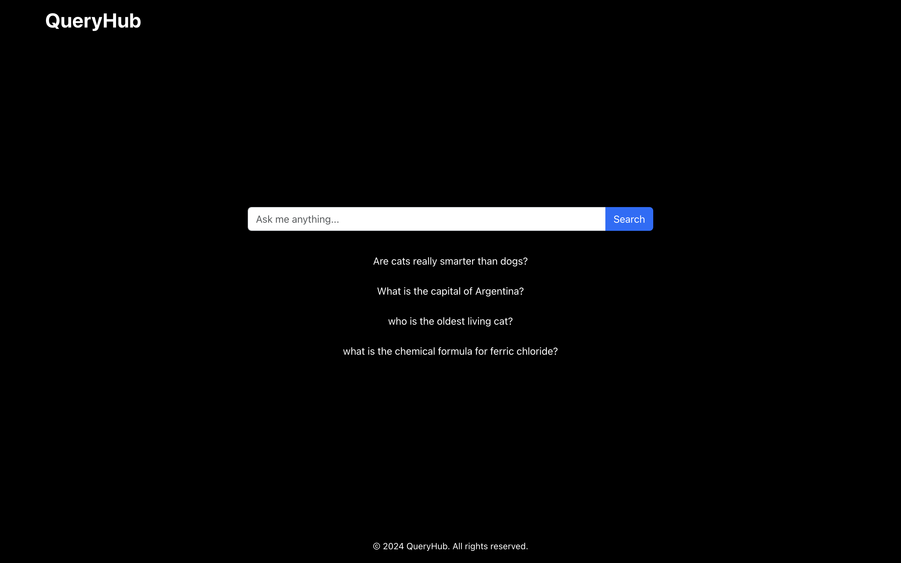
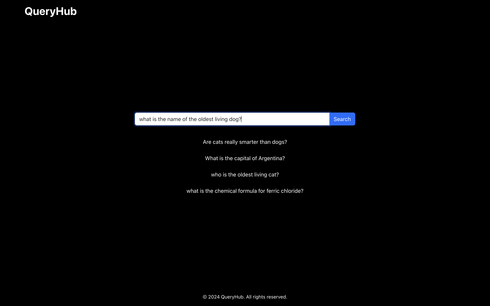
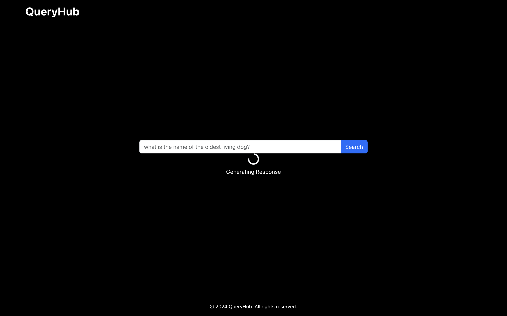
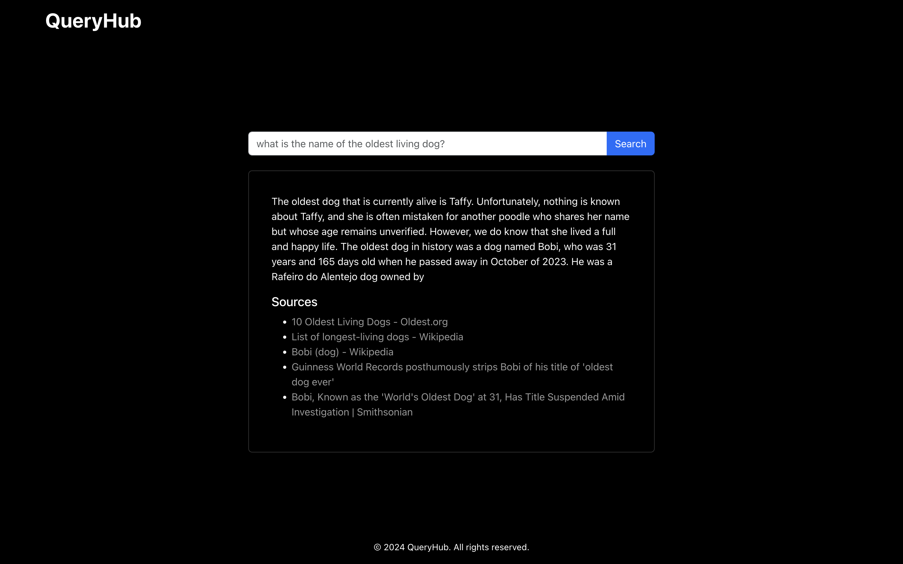
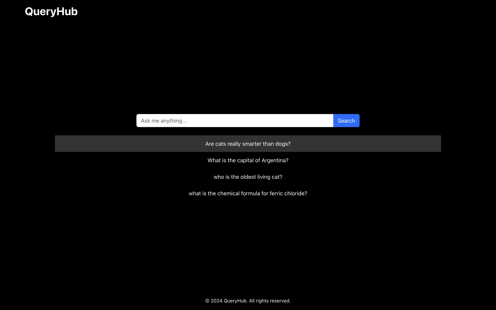
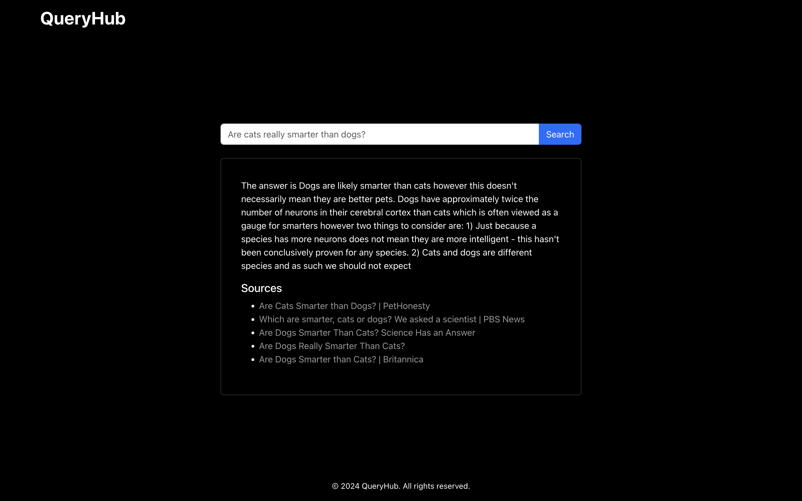

# QueryHub

## Project Overview

**QueryHub** is a Q&A platform designed to provide **concise, AI-generated** answers to user queries with relevant source citations. The system integrates web search APIs and a language model to offer well-rounded answer that makes information retrieval easy and efficient for the user. Additionally QueryHub also tracks **trending** queries to provide users with popular **search suggestions**.

## Objectives

- Accept user queries and perform web searches for the query.
- Generate accurate answers using a language model and the web search results, with references to original sources.
- Handle popular/trending queries by caching frequently requested questions for faster response times.
- Ensure scalability and performance by leveraging Redis caching and API optimizations.

## Setup and Installation [Not required]

The tool is hosted and deployed using **Render web service** and can be accessed here: https://queryhub.onrender.com/

> Caveat: The site is hosted on Render free plan for developers. If not used for some time, it will shutdown automatically and takes upto 50s to come back up (both the site and backend service). Once up it will provide a seamless experience.

> You can clone the repo and try to run the web app locally using Node.js (v14+) but you would require your own API keys and secrets placed in your own .env file.

## Deployment

QueryHub is deployed using two **Render** web services:

1. Web service that runs the **backend** (query and trending endpoints)
2. Web service that serves the React **frontend** app.

The tool can be accessed by anyone through this link: https://queryhub.onrender.com/

## Usage Guidelines

1. **Enter a Query:** Type a question into the search bar to receive an AI-generated answer with relevant sources.
   
   
   
   
2. **View Trending Searches:** Popular or frequently asked questions are listed below the search bar.
3. **Select a Trending Query:** Click on any trending query to view a cached answer (if available) instantly.
   
   

## Design Decisions, Challenges, and Solutions

The backend offers two endpoints **GET /trending** and **POST /query** and consists of
a. **Core components** [Express server, routes and controllers]
b. **Data/memory management solution** [Redis for storage and caching].
These two endpoints are handled as explained below:

### User Query Process:

1. When a user submits a query, the backend checks Redis for a **cached response** using the query text as the key.
2. If a cached response is available, it’s returned immediately.
3. If not it calls **Brave Search API** for relevant data.
4. Using the search data, it generates a new answer using **Cohere API**.
5. Then it caches the answer and sources with a **1-hour TTL** for future requests.

### Trending Query Handling:

1. Each time a query is processed, it’s added to the **Redis sorted set** for trending queries.
2. The system keeps only the top **100 most popular queries** in the sorted set to maintain efficiency and manage memory.
3. The **/trending** endpoint retrieves these popular queries along with their **cached responses if available**, enabling faster user access.

#### Some of the key decisions, challenges, solutions and their limitations:

1. **Search API**: I used the **Brave Search API**. Even though Brave produces **less refined** and **less accurate** results compared to **Google's search API**, it is known for its **relevant ad-free searches** that produces results only from **reputable sources**. Also it provides a generous free plan for developers.
2. **LLM API**: I used the **Cohere API**. I wanted to use the OpenAI API but they don't provide a free tier for developers and have very restrictive usage limits. Cohere API provided **high-quality embeddings**, is **budget-friendly** and **easy to integrate**. Even though the quality might not be the best out there, Cohere’s simplicity, effectiveness, and pricing made it the **most practical choice**.
3. **Processing Queries and Generating Response**:
   1. **Top 5 search results** from the brave search API are used to create a **context** for our LLM to process. I have not experimented with the number of search queries but I felt that 5 search results provided two benefits: **efficient processing** (Fewer results reduce API costs and keep processing times manageable) and **focused answer generation** (The language model can synthesize a relevant answer from a curated subset without being overwhelmed by too much data).
   2. The **context** is used to create the **prompt** that is fed to the Cohere API. Here one of the limitations might be the prompt I used (I wanted experiment with better prompts but couldn't due to time constraints). As for the configuration for Cohere, I used max_tokens 100 and temperature 0.7.
   3. 100 max tokens ensures that responses remain **short, focused, and suitable for quick reading, reduce the overall API usage cost, less processing time** which speeds up the response and enhances user experience. This has two limitations: **Limited Depth** (Restricting tokens can sometimes lead to overly brief answers that lack detail especially for complex queries) and **Risk of Truncation** (For some topics, 100 tokens may not be enough to convey a complete answer, leading to cut-off responses which can be seen in the example I have provided). But this can be adjusted easily.
   4. A temperature of 0.7 allows the model to provide natural, conversational answers without deviating too much from the core information. This setting **balances consistency with a bit of variety**, making responses engaging while still reliable.
4. **Caching**: I use Redis for two tasks: **storing the query with the generated response and storing the trending queries**, their counts and responses.
   1. For **query caching**, I was stuck with two choices: if the query is not present in Redis cache, do we find a similar query in the cache and return the result or generate a new response for the user query and then store it in cache. I felt that if a user wants accurate results we should not use the similar query, but generate an accurate tailor made response for the user. I can explore the following improvement in the future: with a high similarity threshhold, we can actually use the similar query response.
   2. For **trending queries**, it was fairly an easy choice. To show trending queries, we do not care about the exact text of the query but only its **meaning/semantics**. So we can group similar queries together to have an idea about trending queries.
5. **Misc. Backend Challenges**:
   1. **CORS Configuration**: Configured the backend to allow requests only from the specified frontend URL for security.
   2. **Rate Limits**: Implemented error handling to manage API rate limits for Brave and Cohere APIs.
   3. **Memory Management in Redis**: Set a limit of 100 for trending queries and added expirations to manage storage size.
6. **Frontend**: The design choices in the frontend react app were quite straightforward:
   1. **Minimalist Dark Theme**: Inspired by modern knowledge retrieval interfaces, QueryHub’s UI focuses on simplicity and readability.
   2. **Efficient State Management**: React state is used to manage loading states, cached responses, and trending queries for seamless interaction.

## Future Improvements

Apart from the improvements I have talked about above, a few improvements that I feel can be made:

1. **Query History**: Allow users to view past queries and their results.
   Enhanced Similarity Threshold: Adjust the similarity threshold based on user feedback to refine query grouping.
2. **Dynamic Cache Expiry**: Adjust cache expiry based on query frequency to balance freshness and memory usage.
3. **Responsive Frontend Layout**: I was not able to invest much time in responsiveness of the frontend layout, so it might not look good in mobile devices and smaller screens but can be improved easily in React/React-Bootstrap components.
